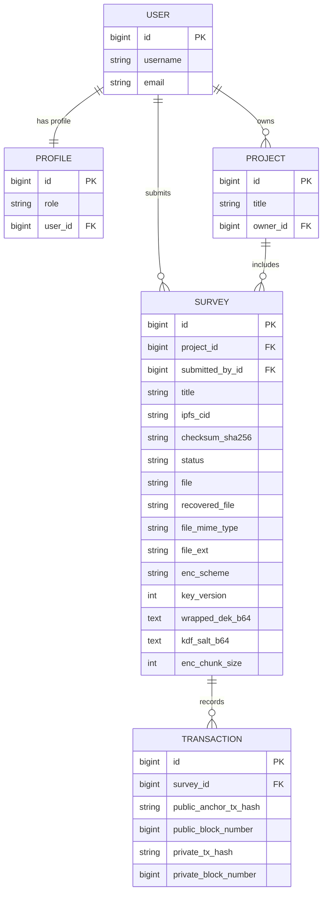
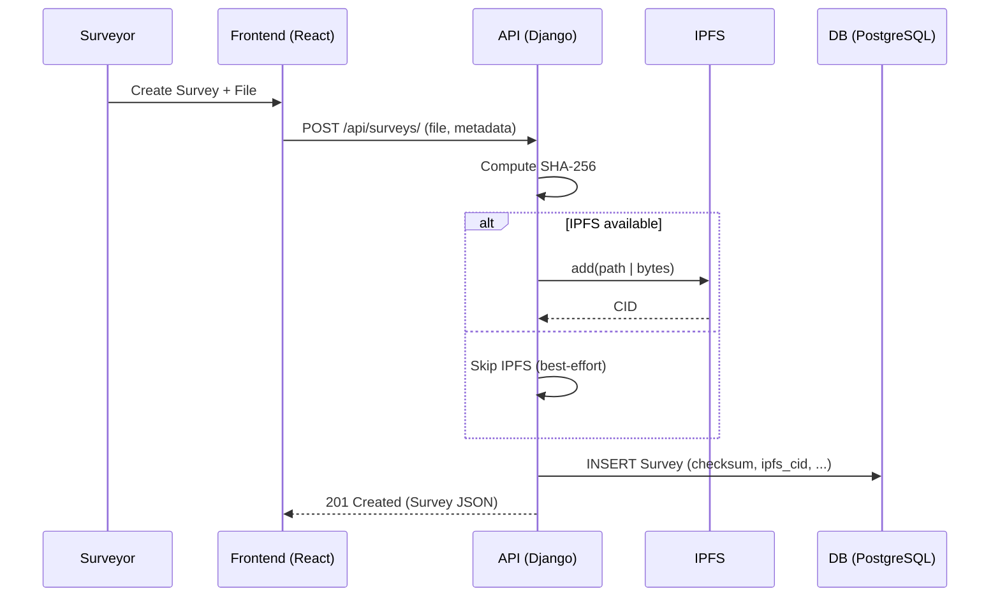
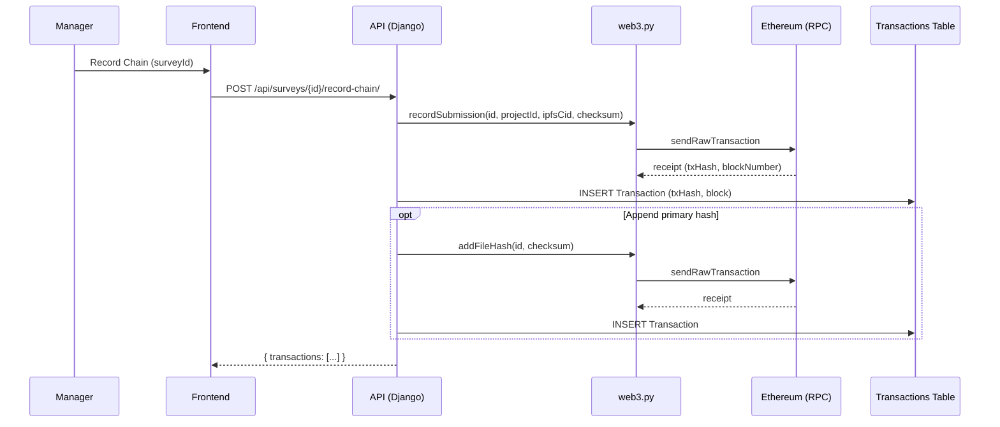
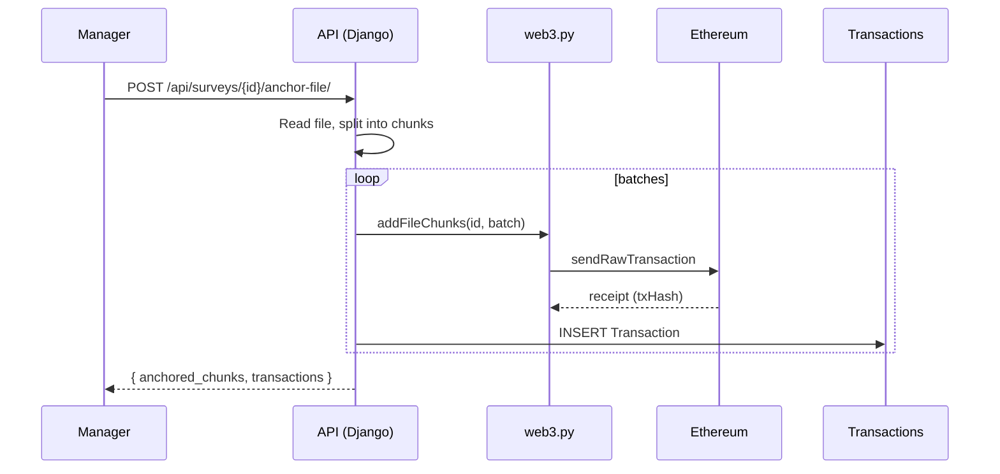
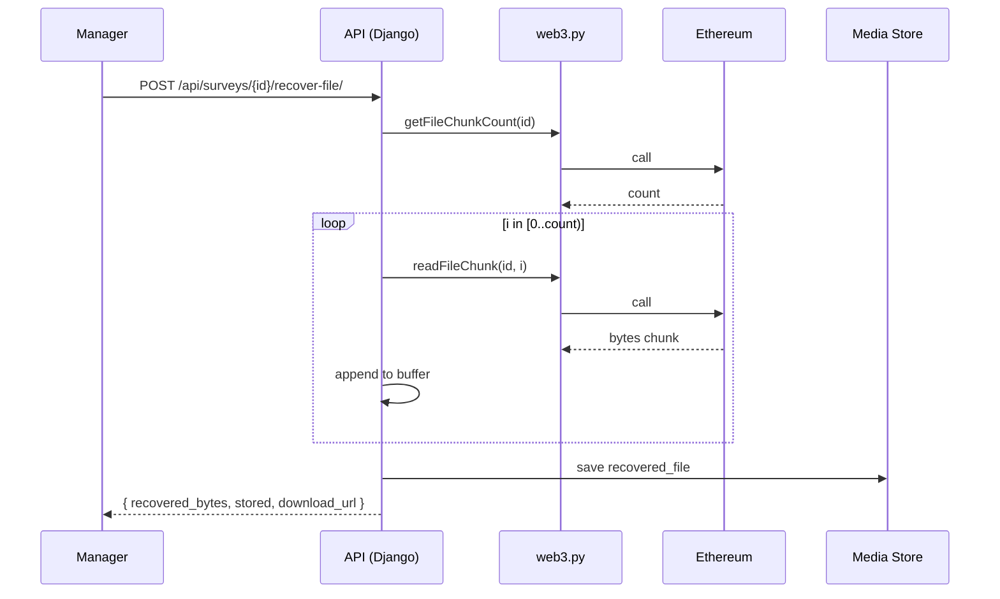
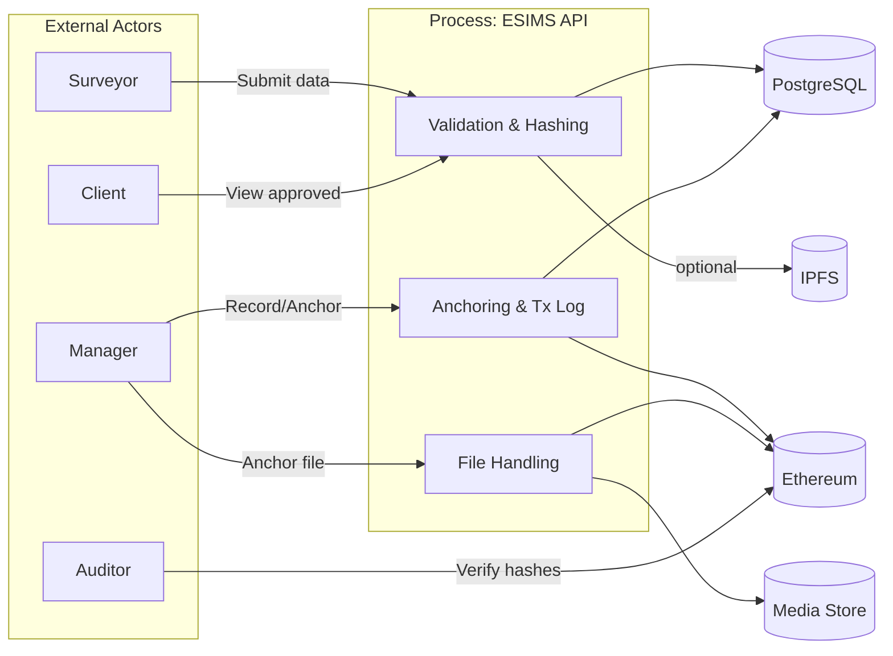

# Chapter 3: System Design and Implementation (ESIMS)

This chapter details the design and implementation of the Engineering Surveying Information Management System (ESIMS) as built in this repository. It links design choices to the research objectives, explains the technical stack, shows how data flows through the system, and documents constraints and trade‑offs relevant to deployment in low‑resource contexts.

## 3.1 Requirements Traceability

- **[R1: Secure, tamper‑evident records]** Store survey integrity artifacts (checksums, provenance) and expose audit trails.
- **[R2: Low‑bandwidth suitability]** Prefer lightweight interactions; avoid large on‑chain payloads by default; support chunking when needed.
- **[R3: Role‑based access]** Protect sensitive operations; map user roles to permissions.
- **[R4: Verifiable anchoring]** Provide optional blockchain anchoring for integrity and public verification.
- **[R5: Practical deployability]** Use commodity infrastructure and common frameworks; run locally and in cloud.

Mapping to implementation:
- R1 via DB metadata and blockchain events (`surveys`, `transactions`, contract events).
- R2 via REST API design, IPFS off‑chain storage, optional raw chunk anchoring, and planned encrypted chunk path.
- R3 via JWT + `users.Profile.role` with app‑level checks in viewsets.
- R4 via Hardhat + Web3 integration in `backend/smartcontracts/eth.py` and MetaMask flows in `frontend/src/lib/eth.ts`.
- R5 via Django, React (Vite), PostgreSQL, IPFS, and Hardhat.

## 3.2 Architecture Overview

The implemented ESIMS follows a modular, service‑oriented design.

```mermaid
flowchart LR
  subgraph Client
    UI[React + Vite (Tailwind)]
    MM[MetaMask (optional)]
  end

  subgraph Backend
    API[Django + DRF API]
    Auth[JWT (SimpleJWT)]
    Web3[web3.py Client]
  end

  DB[(PostgreSQL)]
  IPFS[(IPFS Node)]
  ETH[(Ethereum Node\nHardhat localhost or RPC)]

  UI -->|Axios /api/*| API
  MM -->|sign/tx| ETH
  API -->|JWT| Auth
  API <--> DB
  API -->|upload/read| IPFS
  API -->|txs & calls| Web3
  Web3 --> ETH
```

- Data artifacts (files) are stored off‑chain (Django media, optionally IPFS). Integrity metadata (SHA‑256, CID) is stored in PostgreSQL. Anchoring to Ethereum emits immutable events to support audit.
- The frontend can optionally write to chain via MetaMask; server‑side anchoring is restricted to managers/admins.

## 3.3 Backend Implementation

- Framework and configuration: see `backend/config/settings.py` and `backend/manage.py`.
  - Dependencies: `Django==5`, `djangorestframework`, `djangorestframework-simplejwt`, `django-cors-headers`, `web3`, `ipfshttpclient`, `psycopg`.
  - Environment loading via `python-dotenv`; database via `dj-database-url` with required `DATABASE_URL`.
  - CORS/CSRF configured for development; adjust for production.

- Installed apps (`config/settings.py`):
  - Project apps: `users`, `projects`, `surveys`, `transactions`, `notifications`, `smartcontracts`.
  - DRF and JWT: `rest_framework`, `rest_framework_simplejwt.token_blacklist`.

- Authentication and roles:
  - JWT endpoints: `/api/auth/register|login|refresh|verify|logout` (`backend/users/urls.py`).
  - Profile roles: `surveyor`, `manager`, `client`, `admin` (`backend/users/models.py`).
  - Role checks enforced in viewsets (e.g., `ProjectViewSet`, `SurveyViewSet`).

- Core models:
  - `Survey` (`backend/surveys/models.py`):
    - Integrity: `ipfs_cid`, `checksum_sha256`, `status`.
    - Files: `file`, `recovered_file`, metadata (`file_mime_type`, `file_ext`, `file_category`).
    - Encryption metadata placeholders: `enc_scheme`, `key_version`, `wrapped_dek_b64`, `kdf_salt_b64`, `enc_chunk_size`.
  - `Transaction` (`backend/transactions/models.py`): hashes and (public/private) block numbers.

- Survey workflow and endpoints (`backend/surveys/views.py`):
  - `POST /api/surveys/`: computes SHA‑256, best‑effort IPFS upload, saves metadata; optionally manager‑initiated `recordSubmission` and `addFileHash` on‑chain (best effort, non‑blocking).
  - `POST /api/surveys/{id}/record-chain/`: manager‑only anchoring of integrity record.
  - `POST /api/surveys/{id}/anchor-file/`: current path uploads raw chunks on‑chain via `addFileChunks`.
  - `GET /api/surveys/{id}/chunks/` and `GET /api/surveys/{id}/chunks/{i}/download/`: introspect and stream on‑chain raw chunks.
  - `POST /api/surveys/{id}/recover-file/`: reassembles raw chunks to a stored file in `MEDIA_ROOT`.
  - `POST /api/surveys/{id}/approve|reject/`: updates status; optionally emits on‑chain status events.

- IPFS integration: `ipfshttpclient.connect(IPFS_API_URL)`; `add(path)` or `add_bytes(data)`; writes `ipfs_cid` on success.

- Notes on encryption path: the contract and Python client support encrypted storage via SSTORE2 (`addEncryptedChunks`), and model fields exist to persist envelope/KDF metadata, but the view currently exercises the raw chunk path. See §3.6 for roadmap.

## 3.4 Smart Contracts Layer

- Contract: `backend/smartcontracts/contracts/SurveyRegistry.sol` (Solidity ^0.8.24)
  - State: `surveys[surveyId]`, per‑survey `bytes32[]` file hashes, legacy raw `bytes[]` chunks, SSTORE2 encrypted chunk pointers.
  - Functions: `recordSubmission`, `addFileHash`, `markApproved`, `markRejected`, `addFileChunk(s)`, `addEncryptedChunks`, `get*` readers.
  - Events: `Submitted`, `FileAttached`, `Approved`, `Rejected`, `FileChunk`, `EncryptedChunkStored`.
  - SSTORE2 is used to store opaque encrypted payloads cost‑efficiently (reads via `extcodecopy`).

- Hardhat project: `backend/smartcontracts/`
  - Config: `hardhat.config.js` (localhost chainId 31337; optimizer enabled).
  - Deploy script: `scripts/deploy.js`.
  - ABI export for backend/frontend (`smartcontracts/abi/` and `frontend/src/abi/`).

- Access control: the demo contract does not gate function callers; authorization is enforced at the application layer (e.g., manager‑only server writes). Production deployments should harden contract access (e.g., roles/owner checks or EIP‑712 approvals).

## 3.5 Blockchain Client (Backend)

- Module: `backend/smartcontracts/eth.py`
  - Connection: `get_web3()` uses `ETH_RPC_URL`.
  - Contract loader: `_get_contract()` uses `ETH_CONTRACT_ADDRESS` and ABI file; derives `from` using `ETH_PRIVATE_KEY`.
  - TX builder: `_build_and_send_tx()` estimates gas, sets EIP‑1559 fees, signs with `ETH_PRIVATE_KEY`, and waits for receipt with a short timeout.
  - High‑level ops: `record_submission`, `add_file_hash`, `add_file_chunk(s)`, encrypted chunk helpers, and read APIs.

- Implementation notes:
  - A minor defect exists in `get_tx_receipt()`: it references `w3` without initialization; it should call `get_web3()` (see §3.10).
  - Gas limit headroom is computed but not applied to the final `gas` field; consider using the safe cap to avoid edge failures on congested networks.

## 3.6 Frontend Implementation

- Framework: React 19 + Vite + Tailwind (TailAdmin template) in `frontend/`.
- HTTP client: `src/lib/api.ts` with Axios, JWT injection, refresh interceptor, and a lightweight loading bus.
- Domain services: `src/lib/surveys.ts`, `projects.ts`, `users.ts`, `transactions.ts` align one‑to‑one with backend routes.
- Ethereum helper (optional MetaMask path): `src/lib/eth.ts` supports `recordSubmission`, `addFileHash`, `markApproved`, `markRejected`. Network switching uses `wallet_switchEthereumChain`; Etherscan link helpers are included.
- Dev proxy: `vite.config.ts` proxies `/api` to `VITE_DEV_API_PROXY_TARGET` (default `http://127.0.0.1:8000`).

## 3.7 Data Model, Storage, and Files

- Database: PostgreSQL required (`DATABASE_URL`), enforced at startup (`ImproperlyConfigured` if missing).
  - File storage: Django media files under `backend/media/` with `MEDIA_ROOT` and URLs enabled in debug.
  - Core entities and relationships:



## 3.8 Security, Privacy, and Key Management

- **Auth**: JWT (SimpleJWT) with blacklist and short access token lifetime; session/basic enabled in debug only (`config/settings.py`).
- **RBAC**: Role checks at view level (e.g., manager‑only chain writes, project CRUD restrictions).
- **Transport & CORS**: CORS allowed in dev (`CORS_ALLOW_ALL_ORIGINS=true`); production should scope origins and hosts, and enable HTTPS.
- **Integrity and confidentiality**:
  - Integrity: checksum (SHA‑256) and optional on‑chain anchoring; file hashes can be appended per attachment.
  - Confidentiality: designed for encrypted on‑chain chunks (AES‑GCM payloads via SSTORE2) with envelope or KDF keying. Model fields are present, `smartcontracts.eth.add_encrypted_chunks()` exists, but the current view code uses raw chunks. A future revision should switch `anchor-file` to the encrypted path and persist `wrapped_dek_b64` or `kdf_salt_b64` accordingly.
- **Secrets**: `.env` includes `DJANGO_SECRET_KEY`, `ETH_PRIVATE_KEY`, `DATA_KEK_B64`. Rotate for production; avoid committing real keys.

## 3.9 Deployment and Operations

- Contracts (`backend/smartcontracts/`):
  - Install: `npm install`
  - Local node: `npx hardhat node --hostname 127.0.0.1 --port 8545`
  - Compile: `npx hardhat compile`
  - Deploy (localhost): `npm run deploy:localhost`
  - Export ABI: `npm run export:abi`

- Backend (`backend/`):
  - Install: `pip install -r backend/requirements.txt`
  - Configure `backend/.env` (DB, ETH, IPFS, encryption settings)
  - Run: `python manage.py runserver`

- Frontend (`frontend/`):
  - Install: `npm install`
  - Run dev: `npm run dev` (Vite proxy to backend)

- Observability: endpoints like `GET /health/`, and `transactions` list opportunistically back‑fills block numbers via `get_tx_receipt()`.

## 3.10 Design Trade‑offs, Limitations, and Future Work

- **Encrypted anchoring path**: Contracts and client code support encrypted SSTORE2 chunks; the current API uses raw chunk storage. Next steps:
  1) Add encryption in `anchor-file` path (AES‑GCM per chunk; wrap/derive DEK using `DATA_KEK_B64`).
  2) Persist `enc_scheme`, `key_version`, `wrapped_dek_b64` or `kdf_salt_b64`, `enc_chunk_size` on `Survey`.
  3) Add `GET /api/surveys/{id}/enc-chunks/*` endpoints and recovery flow.

- **Web3 helper fixes**:
  - Initialize `w3` in `get_tx_receipt()` via `get_web3()`.
  - Apply the computed gas cap instead of `gas_estimate * 1.2` directly.

- **Contract access control**: consider adding role gating or EIP‑712 authorizations to minimize misuse on public deployments.

- **Operational hardening**: production CORS/CSRF/ALLOWED_HOSTS tightening; HTTPS termination; rate limiting; audit logging; backups for media/IPFS pins.

- **Testing & CI**: add unit/integration tests for API flows, Web3 calls, and migration checks; wire a simple CI pipeline.

## 3.11 Summary

The implemented ESIMS delivers a pragmatic, modular architecture that balances security, auditability, and deployability:
- A Django + DRF backend with JWT and role‑aware endpoints implements secure data workflows.
- A Solidity registry contract anchors integrity events and supports both raw and encrypted chunk storage (the latter to be wired in the API).
- A React frontend provides operator dashboards and optional MetaMask integrations.
- PostgreSQL and IPFS form an efficient off‑chain storage backbone, with Ethereum anchoring for verifiable integrity.

Together, these components satisfy the study’s objectives while remaining practical for low‑resource environments. The identified next steps (encrypted anchoring path, Web3 helper fixes, access‑control tightening, and ops hardening) form a clear roadmap to production readiness.

# Chapter 3 (Narrative): System Design and Implementation

The Engineering Surveying Information Management System (ESIMS) was implemented to turn the conceptual hybrid‑blockchain approach into a working, modular platform that strengthens integrity, traceability, and operational practicality for surveying projects. The solution is organised as a set of cooperating components: a Django + DRF backend that enforces authentication and roles while exposing a clean REST API; a React + Vite frontend that provides role‑aware dashboards for surveyors, managers, clients, and administrators; a Solidity contract that records integrity events and supports file‑related operations; and a small web3.py client that signs and submits transactions on behalf of authorised backend users. PostgreSQL persists transactional metadata and survey records, while large files reside off‑chain in the Django media store and can optionally be pinned to IPFS. Ethereum is used as an immutable anchor for integrity proofs and, when explicitly requested, for chunked file storage.

On the server, configuration is driven by environment variables loaded in `backend/config/settings.py`. The backend requires a PostgreSQL `DATABASE_URL` and reads integration settings for Ethereum (`ETH_RPC_URL`, `ETH_CHAIN_ID`, `ETH_CONTRACT_ADDRESS`, `ETH_PRIVATE_KEY`) and IPFS (`IPFS_API_URL`). Authentication relies on JSON Web Tokens via SimpleJWT, and every user receives a `users.Profile` with a `role` field that governs access. These roles are enforced at the viewset level; for example, only managers and administrators may trigger on‑chain anchoring from the server, and only they can approve or reject submissions. This approach keeps contract logic simple while ensuring that sensitive operations are gated by organisational policy.

Survey submission follows a consistent flow in `backend/surveys/views.py`. When a surveyor posts a new record, the API computes a SHA‑256 checksum of the uploaded file, infers MIME type and extension, and attempts a best‑effort IPFS upload using the configured HTTP API. The resulting checksum and, if available, IPFS CID are stored on the `Survey` row alongside descriptive metadata. If the caller is a manager or admin and has not opted out with `skip_chain`, the backend records the integrity tuple on chain using `recordSubmission` and, for each file (including optional attachments), appends a `bytes32` hash with `addFileHash`. Every transaction is captured in the `transactions` table for later inspection and auditing. Additional endpoints allow privileged users to anchor entire files on chain as raw chunks, list the number of chunks, download individual chunks, reassemble the complete file into server storage, and fetch a compact on‑chain record suitable for export.

The `SurveyRegistry.sol` contract provides a minimal on‑chain data model: a `surveys` mapping that stores the project identifier, IPFS CID, checksum, status, and submitter; an array of per‑survey file hashes for attachment‑level integrity; and two mechanisms for file storage. The legacy path persists raw `bytes` chunks directly on chain and emits a `FileChunk` event per append. The modern path uses SSTORE2 to store opaque byte payloads at pointer addresses and emits `EncryptedChunkStored` events; the intended use is to store AES‑GCM payloads (nonce + ciphertext + tag) produced either by the backend or a privileged client. In this prototype, access control remains at the application layer, which fits a laboratory deployment but should be reinforced for production with contract‑level roles or EIP‑712 authorisations.

The web3.py helper in `backend/smartcontracts/eth.py` hides the mechanics of transaction construction. It connects to the configured RPC, loads the ABI and contract address, estimates gas, sets EIP‑1559 parameters, signs with the server’s key, and attempts to wait briefly for a receipt. The module exposes concise functions—`record_submission`, `add_file_hash`, `add_file_chunk(s)`, `add_encrypted_chunks`—used by the views. Two small refinements are noted for hardening: the receipt helper should initialise a Web3 instance explicitly, and the computed gas cap should be applied to avoid exceeding block limits in adverse conditions.

On the client side, the Axios wrapper in `frontend/src/lib/api.ts` injects JWT access tokens, refreshes them when needed, and exposes a small “loading bus” for user feedback. Feature‑oriented service modules (`surveys.ts`, `projects.ts`, `users.ts`, `transactions.ts`) map directly to backend endpoints, which keeps the UI thin and predictable. An optional MetaMask path in `frontend/src/lib/eth.ts` allows users to submit transactions from the browser; it handles network switching, constructs contract calls with Ethers, and returns transaction hashes for display. During development, Vite proxies `/api/*` calls to the Django server to avoid CORS complexity.

Security and privacy choices reflect a pragmatic balance for low‑resource settings. JWT authentication, explicit role checks, and conservative defaults in development keep the barrier to running the system low while making it straightforward to harden for production by scoping CORS and hosts, enabling HTTPS, and rotating secrets. Integrity is preserved through deterministic checksums and optional blockchain anchoring; confidentiality is planned through encrypted on‑chain storage using SSTORE2 with envelope encryption or KDF‑derived keys. The database schema already includes the fields required to persist key‑wrapping metadata and chunk size, and the Python client can submit encrypted payloads; wiring the view to switch from raw to encrypted chunks is the principal outstanding task for confidentiality.

Operationally, the repository includes everything needed to run locally: a Hardhat project to start a development chain and deploy the contract, a Django backend with environment‑driven configuration, and a Vite frontend with a proxy to the API. This yields a tight feedback loop for verifying flows end‑to‑end while keeping the stack familiar and supportable. Limitations are explicit: the encrypted anchoring path is not yet enabled in the API; the web3 helper warrants two small fixes; contract access control is intentionally minimal; and production deployments should add tests, CI, stricter security headers, and backup strategies for media and IPFS pins.

# Chapter 4 (Narrative): Demonstration and Analysis

This chapter demonstrates how the implemented ESIMS behaves in practice and analyses its properties using observable, reproducible behaviours rather than synthetic performance claims. The prototype is exercised in a development environment with a local Hardhat node, a Django server configured with a PostgreSQL database and `.env` variables, and a Vite frontend that proxies API traffic. The same flows can be executed against a remote RPC and database by providing the appropriate environment settings.

The first demonstration focuses on the core submission pipeline. A surveyor signs in, creates a new survey, and attaches a file. On receipt, the backend computes a SHA‑256 checksum and records descriptive metadata. If the IPFS API is available, the file path or bytes are submitted to the node and the resulting CID is stored on the `Survey`. The row can be inspected through the API to confirm the checksum and, when present, the CID. Role‑based visibility ensures that only the submitter and privileged users can see the full submission initially, while clients are limited to approved artefacts.

The second demonstration exercises integrity anchoring from the server. Acting as a manager, a user invokes the `record-chain` action, which calls `recordSubmission` and, when a checksum exists, `addFileHash`. Each transaction is persisted to the `transactions` table. The API can then be queried to list transactions for the survey, and the contract state can be read back through `onchain-record` to verify that the expected fields were written. This flow shows how auditability is achieved without altering the main data path or exposing private files.

The third demonstration stores a full file on chain using the raw chunk path. A manager calls `anchor-file`, the backend reads the file, splits it into fixed‑size chunks, and appends them to the contract while recording each transaction. The `chunks` and `chunks/{i}/download` endpoints allow inspection and retrieval, and `recover-file` reassembles the chunks into a new file under `MEDIA_ROOT`. A straightforward check is to compare the recovered file’s hash with the original; a match confirms a lossless round‑trip. This path validates the contract storage API but, because raw bytes are public on transparent chains, it is primarily suitable for controlled networks or non‑confidential artefacts.

The fourth demonstration validates the optional browser‑anchoring path. With MetaMask connected to the development network, a user can submit the same operations from the UI: `recordSubmission`, `addFileHash`, and status updates. The frontend’s Ethereum helper ensures the correct network is selected and returns transaction hashes that can be cross‑checked in the `transactions` list if desired. This confirms that the system supports both server‑mediated and user‑mediated integrity anchoring.

From these demonstrations, several qualitative findings emerge. The RBAC model enforced by `users.Profile.role` effectively separates duties between surveyors (who submit data), managers (who approve and anchor), and clients (who view approved outcomes). Integrity indicators are captured consistently: SHA‑256 checksums and, when available, IPFS CIDs in the database, plus on‑chain events and state that can be queried independently. The system behaves defensively when integrations are unavailable—on‑chain calls are best‑effort and never block core submission, and IPFS upload failures do not prevent persistence of the record. These choices align with the constraints of low‑resource environments where connectivity and infrastructure may be intermittent.

The analysis also highlights intended evolutions. For confidential artefacts, the encrypted SSTORE2 path should replace raw chunk storage in the `anchor-file` action, with the API persisting envelope metadata (`wrapped_dek_b64` and `key_version`) or KDF salt in the database. Contract‑level access control can complement application‑level checks for deployments on shared networks. Finally, production‑grade deployments should tighten CORS and host settings, enable HTTPS, add rate‑limiting and audit logging, and adopt routine backup and pinning strategies for media and IPFS.

In summary, the implementation validates the study’s core premise: it is feasible to combine familiar web technologies with selective blockchain anchoring to improve trust and traceability in surveying information management. The prototype provides clear points of extension—chiefly encrypted on‑chain storage and operational hardening—that can be addressed incrementally without disrupting existing workflows. The result is a practical pathway from laboratory demonstration to field deployment in resource‑constrained contexts.

## 3.12 Additional Design Diagrams (Mermaid)

### 3.12.1 System Context Diagram

```mermaid
flowchart TB
  %% Actors
  actor_surveyor([Surveyor])
  actor_manager([Manager])
  actor_client([Client])
  actor_auditor([Auditor])

  %% Frontend / Backend
  subgraph FE[Frontend (React + Vite)]
    fe_ui[Dashboards & Forms]
  end

  subgraph BE[Backend (Django + DRF)]
    be_api[/REST API/]
    be_auth[JWT Auth (SimpleJWT)]
  end

  subgraph DS[Data Stores]
    db[(PostgreSQL)]
    media[(Django Media)]
    ipfs[(IPFS Node)]
  end

  subgraph CHAIN[Ethereum]
    rpc[[RPC (Hardhat/Remote)]]
    contract[[SurveyRegistry.sol]]
  end

  %% Flows
  actor_surveyor --> fe_ui
  actor_manager --> fe_ui
  actor_client --> fe_ui
  actor_auditor --> fe_ui
  fe_ui -->|/api/*| be_api
  be_api --> be_auth
  be_api <--> db
  be_api <--> media
  be_api -->|add/read| ipfs
  be_api -->|web3.py| rpc --> contract
```

### 3.12.2 Deployment Diagram (Logical)

```mermaid
flowchart LR
  subgraph UserDevice[User Device]
    browser[Browser]
    metamask[MetaMask (optional)]
  end

  subgraph FrontendHost[Frontend Dev/Static Host]
    vite[Vite Dev Server or Static Files]
  end

  subgraph AppServer[Application Server]
    django[Django + DRF]
    env[[.env: DB URL, ETH RPC, IPFS, JWT]]
  end

  subgraph DataTier[Data Tier]
    pg[(PostgreSQL)]
    media_store[(MEDIA_ROOT)]
    ipfs_node[(IPFS HTTP API)]
  end

  subgraph Chain[Blockchain]
    hardhat[Hardhat Node]
    survey_registry[[SurveyRegistry Contract]]
  end

  browser --> vite
  vite --> django
  browser -->|/api| django
  browser --> metamask
  metamask --> hardhat
  django --> pg
  django --> media_store
  django --> ipfs_node
  django --> hardhat
  hardhat --> survey_registry
```

### 3.12.3 Sequence: Survey Submission



### 3.12.4 Sequence: Record Integrity On-Chain



### 3.12.5 Sequence: Anchor File (Raw Chunks)



### 3.12.6 Sequence: Recover File (Raw Chunks)



### 3.12.7 Survey State Diagram

```mermaid
stateDiagram-v2
  [*] --> submitted
  submitted --> approved: approve()
  submitted --> rejected: reject()

  state submitted {
    note right of submitted
      On-chain event optional:
      Submitted(surveyId,...)
    end note
  }
  state approved {
    note right of approved
      On-chain event optional:
      Approved(surveyId,...)
    end note
  }
  state rejected {
    note right of rejected
      On-chain event optional:
      Rejected(surveyId,...)
    end note
  }
```

### 3.12.8 Data Flow Diagram (Level 0)


